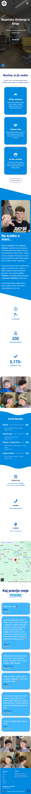
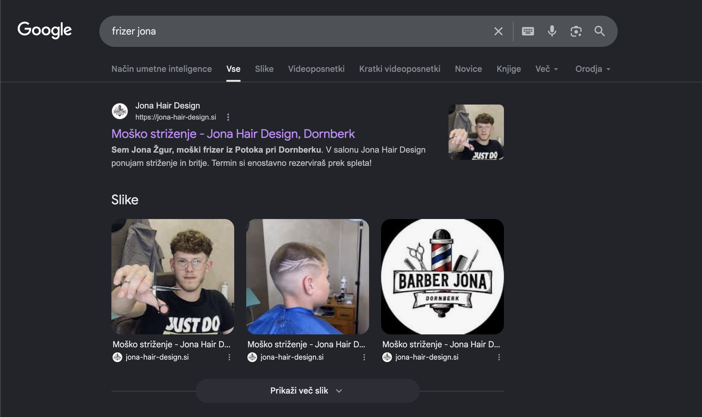

# Jona Hair Design

Spletna stran je bila izdelana v **WordPressu** z uporabo urejevalnika **Elementor**. Namen projekta je bil ustvariti moderno, pregledno in odzivno spletno stran za frizerski salon, ki uporabnikom omogoča spletno naročanje prek platforme LimeBooking, hiter pregled storitev, cenika, lokacije in kontaktnih informacij.

---

## O projektu

Projekt predstavlja spletno stran za frizerski salon **Jona Hair Design**, ki je usmerjena predvsem v moško striženje in britje.

---

## Uporabljene tehnologije

- WordPress
- Elementor
- HTML
- CSS
- Responsive web design
- Osnovna SEO optimizacija

---

## Glavne funkcionalnosti

- Moderna in pregledna začetna stran
- Spletno naročanje
- Predstavitev storitev
- Cenik storitev
- Predstavitev frizerja
- Prikaz lokacije
- Kontaktni podatki
- Mnenja strank
- Odziven prikaz za mobilne naprave
- Osnovna optimizacija za iskalnike

---

## Desktop prikaz spletne strani

Spodaj bo dodan posnetek zaslona celotne spletne strani v namizni različici.

<!-- Tukaj dodaj desktop screenshot -->

---

## Mobilni prikaz / odzivnost

Spodaj bo dodan posnetek zaslona mobilne različice spletne strani, ki prikazuje odzivnost dizajna.

<!-- Tukaj dodaj mobile screenshot -->

---

## SEO optimizacija

Spletna stran je indeksirana v Googlu in se prikaže med prvimi rezultati za relevantno iskanje. To prikazuje osnovno SEO optimizacijo spletne strani.

<!-- Tukaj dodaj screenshot Google rezultata -->

---

## Namen projekta

Projekt je bil izdelan kot zaključna naloga 4. letnika srednje računalniške šole.

---

## Avtor

**Elija Cermelj**
